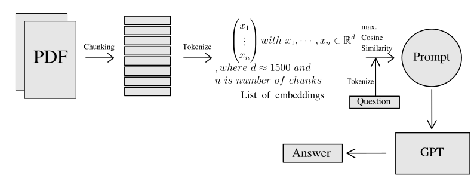

# Using OpenAI Embeddings in Order to Use an LLM with a Custom Corpus

# Quick Overview
The goal of this project will be to use a large language model (LLM) with a custom corpus containing information about the University of Greifswald (e.g. research of individual professors, study regulations, etc.).\
For this titles of research papers of professors of the University of Greifswald and PDF files of e.g. study regulations have been gathered and split into chunks adhering to the input token limit of GPT.\

# Dependencies

**Python packages**
~~~
openai tiktoken selenium scikit-learn seaborn flask h5py adjustText typing argparse pathlib numpy pandas datetime matplotlib plotly
~~~

|**Additional dependencies**|
|---|
|pdftotext for UNIX|
|Firefox Geckodriver v0.33 or higher|

# Introduction
LLMs like ChatGPT can be asked to perform a specific task and produce output that is a **likely continuation** of the input string. The generation of the output of the associated neural network is dependent upon its training data as well as the information that it has at hand. OpenAI has used a large amount of training data from sources in the internet to train its LLMs.  Be warned that an LLM can **hallucinate**, i.e. generate answers that are made up due to lack of information on a specific problem.\
Thus creating a custom corpus, an information backlog of sorts is important, if hallucinations are to be avoided or at least minimized.\
Although as a byproduct, this project happens to generalize the process of corpus customization to a point where the corpus can be easily modified or expanded upon, the main goal of it is using an LLM that can reliably answer questions that we are asking it about the University of Greifswald.\

# Acquiring data
The process of acquiring data can be a tedious one. That's why we chose to partially automatize it. Webofscience.com (WOS) was chosen as a source of information for scientific papers of individual professors of the University of Greifswald. While Google Scholar offers a larger amount of data, it is also prone to misassigning research papers to individuals, as well as not featuring scientific papers exclusively, but also other contributions loosely related to science (like chapters of books, editorial work).\
The only manual data annotation that had to be done was visiting the individual's WOS profile and copying the ID to a spreadsheet, along with some more meta data like the name of the department.\
From there on a webcrawler was coded, which reads the ID's from the spreadsheet and visits each researcher profile consecutively in a headless firefox session, launching a JavaScript code snippet that extracts all links from any website. These links were then filtered with the help of a function that returns only the links pointing to a full text on each profile page. The filtered links were written to TXT files.\
Additionally PDF files containing study regulations and so forth were also downloaded manually.\
Functions to automatize the reading of PDF files have been written. The resulting texts have been seperated into chunks to adhere to the token limit of GPT.

# An OpenAI interface
GPT is a next-token predictor. It generates the next token based on a probablity distribution computed from the token sequence up to that point in time. Here, tokens are substrings that are typically a few characters long. For a string of input tokens, GPT predicts the likely continuation of the the prompt and outputs it. Since GPT has a token input limit, it is not feasible to feed all the chunks to it at once. Rather, as part of the prompt, chunks of text that contain the information the user is looking for, are fed to GPT via the use of embeddings. Individual embeddings are stored once they have been generated to cut down on costs, since tokenization is the actual process of using OpenAI's pretrained model and this service is not free.

# Evaluation
As a proof of concept a t-sNE plot has been generated for visualization of the clustering of fields of research. Using cosine similarity to compare the embeddings of the individual professors and the titles of 50 of their most recent papers, followed by a projection into two-dimensional space resulted in the following plot.
<object data="https://github.com/mslehre/text-embedding/tree/master/docs/pub_tsne_plot_with_edges.pdf" type="application/pdf" width="700px" height="700px">
    <embed src="https://github.com/mslehre/text-embedding/tree/master/docs/pub_tsne_plot_with_edges.pdf">
        
As of now, Github does not support viewing PDFs in MD files, click the following to view it: <a href="https://github.com/mslehre/text-embedding/tree/master/docs/pub_tsne_plot_with_edges.pdf">Download PDF</a>.

    </embed>
</object>
